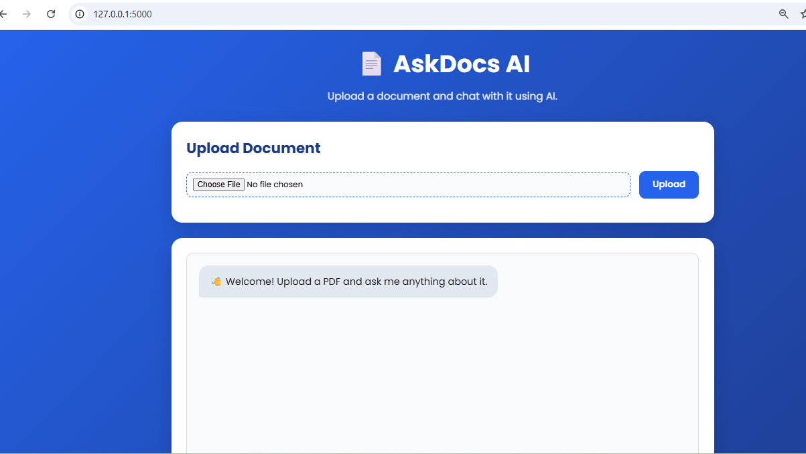
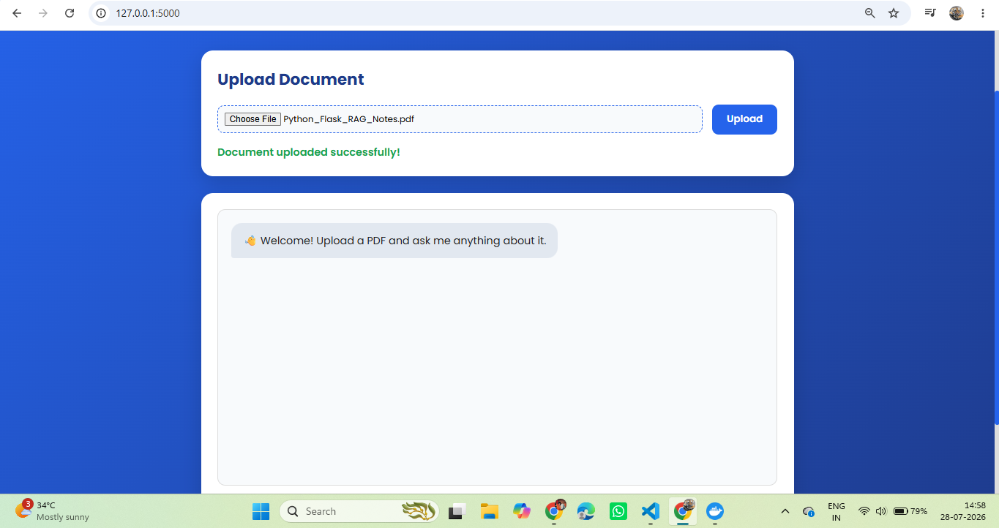
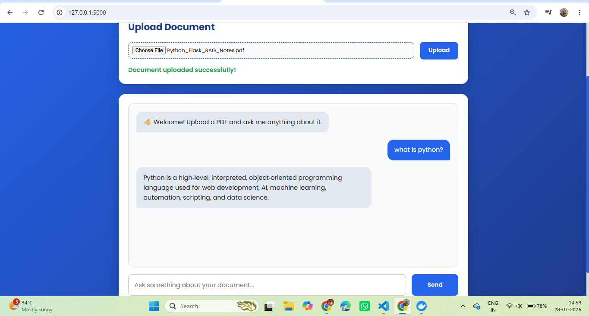

# 📄 AskDocs - AI Document Chatbot (RAG)

AskDocs is an AI-powered document question-answering application built using **Flask**, **Qdrant Vector Database**, **Sentence Transformers**, and **OpenRouter LLM**. Users can upload PDF documents, and the application answers questions based only on the uploaded document using Retrieval-Augmented Generation (RAG).

---

## 🚀 Features

- Upload PDF documents
- Extract text from PDFs
- Split documents into chunks
- Generate vector embeddings using Sentence Transformers
- Store embeddings in Qdrant Vector Database
- Perform semantic similarity search
- Generate context-aware answers using OpenRouter LLM
- Clean and responsive web interface built with Flask

---

## 🛠️ Tech Stack

### Backend
- Python
- Flask

### AI & NLP
- Sentence Transformers
- OpenRouter API
- Retrieval-Augmented Generation (RAG)

### Vector Database
- Qdrant

### Frontend
- HTML
- CSS
- JavaScript

### Libraries
- pypdf
- qdrant-client
- requests
- python-dotenv

---

## 📂 Project Structure

```
AskDocs/
│
├── app.py
├── requirements.txt
├── .env
├── README.md
│
├── rag/
│   ├── pdf_loader.py
│   ├── chunker.py
│   ├── embedding.py
│   ├── qdrant_db.py
│   ├── retriever.py
│   ├── rag_pipeline.py
│   └── llm.py
│
├── templates/
│   └── index.html
│
├── static/
│   ├── css/
│   └── js/
│
├── uploads/
│
└── screenshots/
```

---

## ⚙️ Installation

### 1. Clone the repository

```bash
git clone https://github.com/vasu04-git/AskDocs.git

cd AskDocs
```

### 2. Create a virtual environment

```bash
python -m venv venv
```

### 3. Activate the virtual environment

Windows

```bash
venv\Scripts\activate
```

Linux / macOS

```bash
source venv/bin/activate
```

### 4. Install dependencies

```bash
pip install -r requirements.txt
```

---

## 🔑 Configure Environment Variables

Create a `.env` file in the project root.

```env
OPENROUTER_API_KEY=your_api_key_here
```

---

## 🐳 Run Qdrant

```bash
docker run -d \
--name qdrant \
-p 6333:6333 \
-p 6334:6334 \
-v qdrant_storage:/qdrant/storage \
qdrant/qdrant
```

---

## ▶️ Run the Application

```bash
python app.py
```

Open your browser:

```
http://127.0.0.1:5000
```

---

## 🔄 RAG Workflow

1. Upload a PDF document.
2. Extract text from the PDF.
3. Split text into smaller chunks.
4. Generate embeddings for each chunk.
5. Store embeddings in Qdrant.
6. Convert the user's question into an embedding.
7. Retrieve the most relevant chunks.
8. Send the retrieved context to the LLM.
9. Return an answer based on the document.

---

## 📸 Screenshots

<h2>Home Page</h2>
[[](https://github.com/vasu04-git/AskDocs/blob/main/home.png)]

<h2>Upload PDF</h2>

[](https://github.com/vasu04-git/AskDocs/blob/main/upload.png)

<h2>AI Answer</h2>

[](https://github.com/vasu04-git/AskDocs/blob/main/response.png)

## 📌 Future Improvements

- Support multiple PDFs
- Chat history
- User authentication
- Streaming responses
- Source citations
- OCR support for scanned PDFs
- Support DOCX and TXT files
- Deploy using Docker and Render

---


## 👨‍💻 Author

**Vasudhevan**

If you found this project useful, consider giving it a ⭐ on GitHub.
